# Workflows Documentation

> **Last Updated:** 2026-01-21  
> **Documentation Type:** User & System Workflows

## Overview

This document details the key workflows in the Chatterbox platform, including user flows, data flows, and system processes. Each workflow includes sequence diagrams, step-by-step descriptions, and error handling considerations.

---

## Table of Contents

1. [Authentication Workflows](#authentication-workflows)
2. [Family Management Workflows](#family-management-workflows)
3. [Child Account Workflows](#child-account-workflows)
4. [Chore Management Workflows](#chore-management-workflows)
5. [Educational Content Workflows](#educational-content-workflows)
6. [Gamification Workflows](#gamification-workflows)
7. [Admin Workflows](#admin-workflows)
8. [Error Recovery Workflows](#error-recovery-workflows)

---

## Authentication Workflows

### Parent Registration Flow

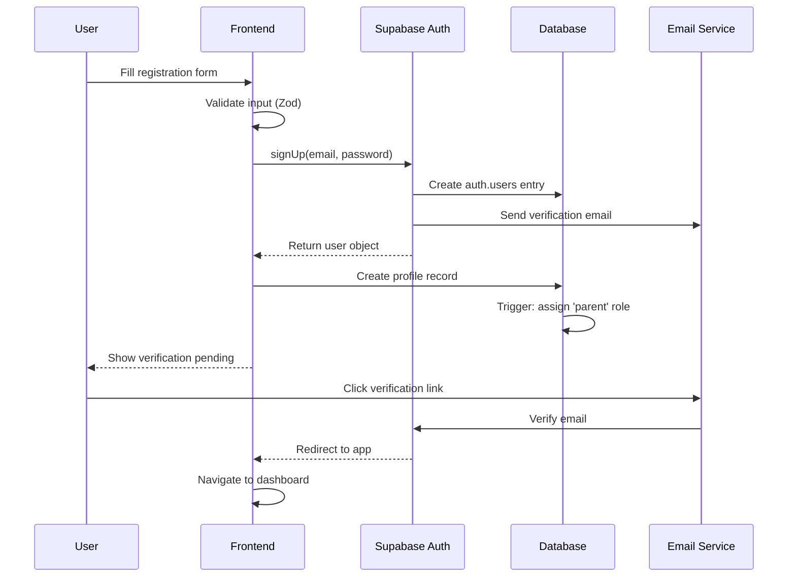
```mermaid
sequenceDiagram
    participant User
    participant Frontend
    participant Supabase Auth
    participant Database
    participant Email Service

    User->>Frontend: Fill registration form
    Frontend->>Frontend: Validate input (Zod)
    Frontend->>Supabase Auth: signUp(email, password)
    Supabase Auth->>Database: Create auth.users entry
    Supabase Auth->>Email Service: Send verification email
    Supabase Auth-->>Frontend: Return user object
    Frontend->>Database: Create profile record
    Database->>Database: Trigger: assign 'parent' role
    Frontend-->>User: Show verification pending
    User->>Email Service: Click verification link
    Email Service->>Supabase Auth: Verify email
    Supabase Auth-->>Frontend: Redirect to app
    Frontend->>Frontend: Navigate to dashboard
```

**Steps:**
1. User enters email, password, name
2. Frontend validates input with Zod schemas
3. Call `supabase.auth.signUp()`
4. Supabase creates user in `auth.users`
5. Database trigger creates profile in `profiles`
6. Database trigger assigns 'parent' role
7. Verification email sent
8. User clicks verification link
9. Redirect to parent dashboard

**Error Handling:**
- Invalid email format → Show validation error
- Password too weak → Show requirements
- Email already exists → Show login suggestion
- Network error → Show retry option

---

### Login Flow

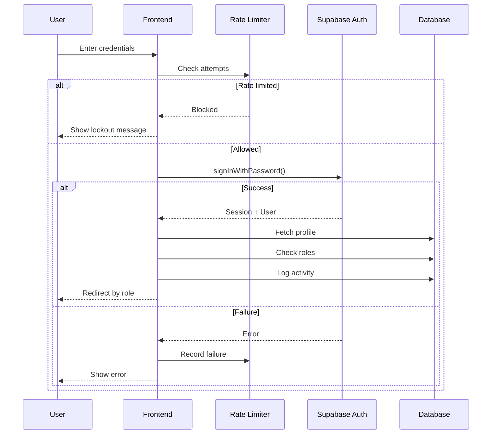
```mermaid
sequenceDiagram
    participant User
    participant Frontend
    participant Rate Limiter
    participant Supabase Auth
    participant Database

    User->>Frontend: Enter credentials
    Frontend->>Rate Limiter: Check attempts
    alt Rate limited
        Rate Limiter-->>Frontend: Blocked
        Frontend-->>User: Show lockout message
    else Allowed
        Frontend->>Supabase Auth: signInWithPassword()
        alt Success
            Supabase Auth-->>Frontend: Session + User
            Frontend->>Database: Fetch profile
            Frontend->>Database: Check roles
            Frontend->>Database: Log activity
            Frontend-->>User: Redirect by role
        else Failure
            Supabase Auth-->>Frontend: Error
            Frontend->>Rate Limiter: Record failure
            Frontend-->>User: Show error
        end
    end
```

**Steps:**
1. User enters email and password
2. Check rate limiter (5 attempts/15 min)
3. Call `supabase.auth.signInWithPassword()`
4. On success: fetch profile, verify roles
5. Log login activity for audit
6. Redirect based on role (admin/parent/child)

**Error Handling:**
- Invalid credentials → Increment failure count
- Account locked → Show unlock instructions
- Network error → Suggest retry
- Session expired → Refresh token

---

### Password Reset Flow

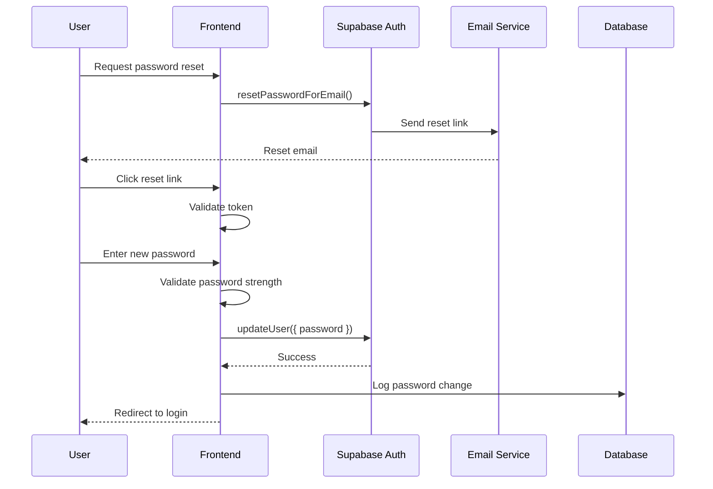
```mermaid
sequenceDiagram
    participant User
    participant Frontend
    participant Supabase Auth
    participant Email Service
    participant Database

    User->>Frontend: Request password reset
    Frontend->>Supabase Auth: resetPasswordForEmail()
    Supabase Auth->>Email Service: Send reset link
    Email Service-->>User: Reset email
    User->>Frontend: Click reset link
    Frontend->>Frontend: Validate token
    User->>Frontend: Enter new password
    Frontend->>Frontend: Validate password strength
    Frontend->>Supabase Auth: updateUser({ password })
    Supabase Auth-->>Frontend: Success
    Frontend->>Database: Log password change
    Frontend-->>User: Redirect to login
```

---

## Family Management Workflows

### Create Family Flow

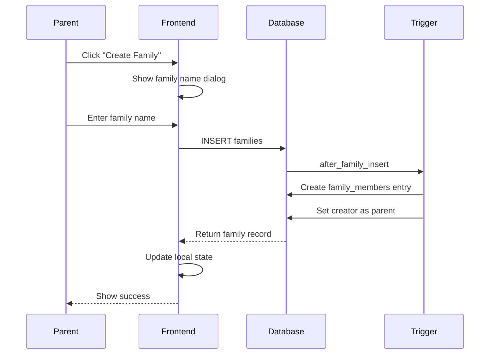
```mermaid
sequenceDiagram
    participant Parent
    participant Frontend
    participant Database
    participant Trigger

    Parent->>Frontend: Click "Create Family"
    Frontend->>Frontend: Show family name dialog
    Parent->>Frontend: Enter family name
    Frontend->>Database: INSERT families
    Database->>Trigger: after_family_insert
    Trigger->>Database: Create family_members entry
    Trigger->>Database: Set creator as parent
    Database-->>Frontend: Return family record
    Frontend->>Frontend: Update local state
    Frontend-->>Parent: Show success
```

**Steps:**
1. Parent clicks create family button
2. Enter family name (with suggestions)
3. Insert into `families` table
4. Trigger creates `family_members` entry
5. Creator assigned as family parent
6. Update frontend state
7. Show confirmation

---

### Invite Family Member Flow

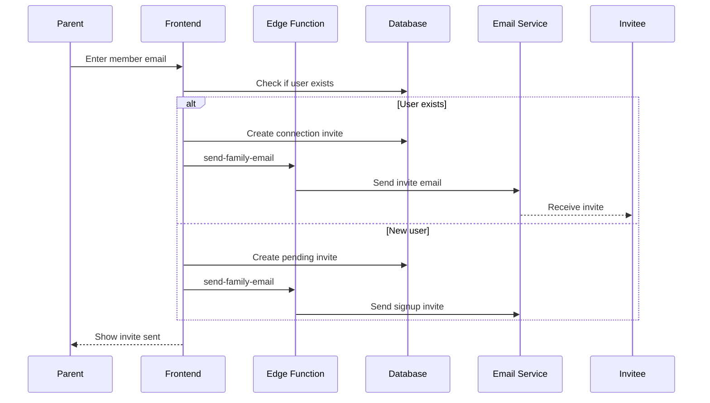
```mermaid
sequenceDiagram
    participant Parent
    participant Frontend
    participant Edge Function
    participant Database
    participant Email Service

    Parent->>Frontend: Enter member email
    Frontend->>Database: Check if user exists
    alt User exists
        Frontend->>Database: Create connection invite
        Frontend->>Edge Function: send-family-email
        Edge Function->>Email Service: Send invite email
        Email Service-->>Invitee: Receive invite
    else New user
        Frontend->>Database: Create pending invite
        Frontend->>Edge Function: send-family-email
        Edge Function->>Email Service: Send signup invite
    end
    Frontend-->>Parent: Show invite sent
```

---

## Child Account Workflows

### Create Child Account Flow

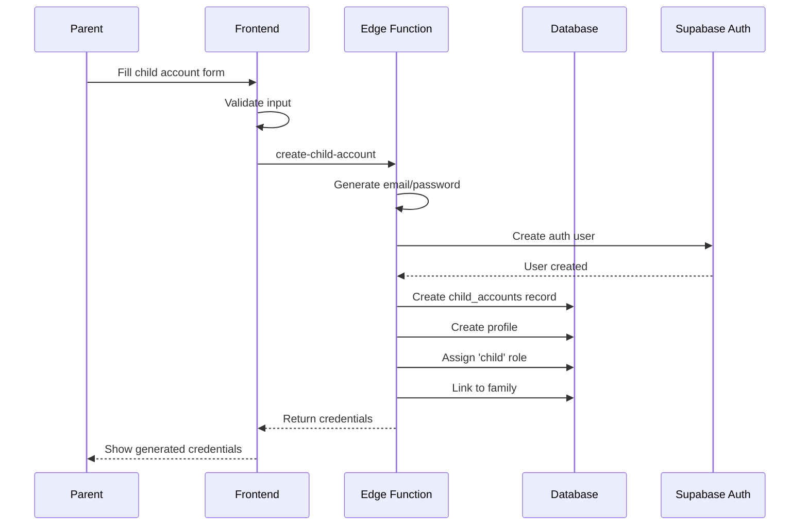
```mermaid
sequenceDiagram
    participant Parent
    participant Frontend
    participant Edge Function
    participant Database
    participant Supabase Auth

    Parent->>Frontend: Fill child account form
    Frontend->>Frontend: Validate input
    Frontend->>Edge Function: create-child-account
    Edge Function->>Edge Function: Generate email/password
    Edge Function->>Supabase Auth: Create auth user
    Supabase Auth-->>Edge Function: User created
    Edge Function->>Database: Create child_accounts record
    Edge Function->>Database: Create profile
    Edge Function->>Database: Assign 'child' role
    Edge Function->>Database: Link to family
    Edge Function-->>Frontend: Return credentials
    Frontend-->>Parent: Show generated credentials
```

**Steps:**
1. Parent enters child's first name, last name
2. Edge function generates unique email
3. Generate secure temporary password
4. Create auth user via admin API
5. Create child_accounts record
6. Create profile record
7. Assign 'child' role
8. Link to family
9. Return generated credentials

**Security:**
- Password meets security requirements
- Email is unique within system
- Parent must be family member
- COPPA compliance for data handling

---

### Child Login Flow

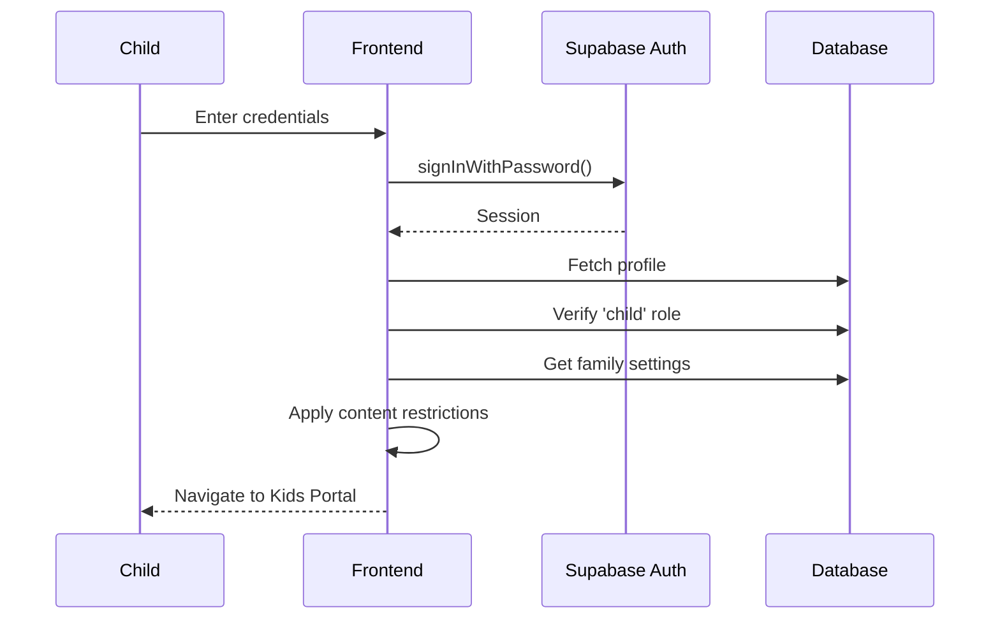
```mermaid
sequenceDiagram
    participant Child
    participant Frontend
    participant Supabase Auth
    participant Database

    Child->>Frontend: Enter credentials
    Frontend->>Supabase Auth: signInWithPassword()
    Supabase Auth-->>Frontend: Session
    Frontend->>Database: Fetch profile
    Frontend->>Database: Verify 'child' role
    Frontend->>Database: Get family settings
    Frontend->>Frontend: Apply content restrictions
    Frontend-->>Child: Navigate to Kids Portal
```

---

## Chore Management Workflows

### Assign Chore Flow

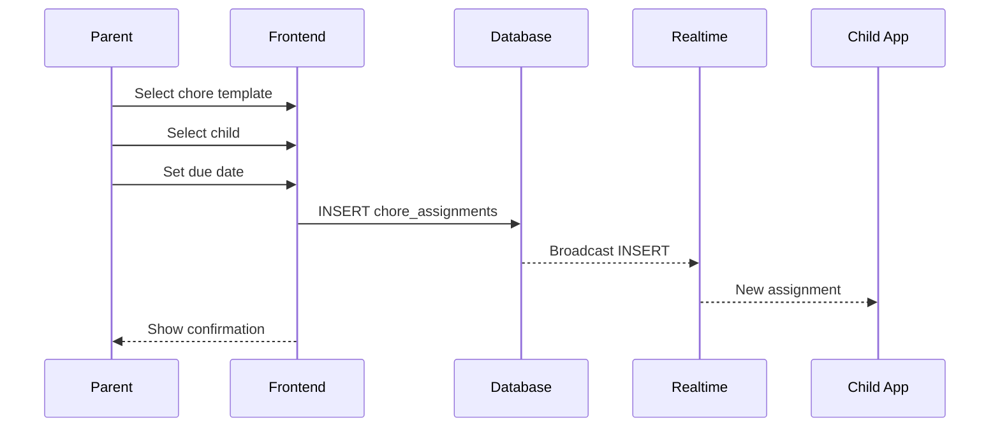
```mermaid
sequenceDiagram
    participant Parent
    participant Frontend
    participant Database
    participant Realtime

    Parent->>Frontend: Select chore template
    Parent->>Frontend: Select child
    Parent->>Frontend: Set due date
    Frontend->>Database: INSERT chore_assignments
    Database-->>Realtime: Broadcast INSERT
    Realtime-->>Child App: New assignment
    Frontend-->>Parent: Show confirmation
```

**Steps:**
1. Parent selects chore from templates
2. Choose child to assign
3. Set optional due date
4. Create assignment record
5. Realtime notifies child
6. Update both parent and child views

---

### Complete Chore Flow

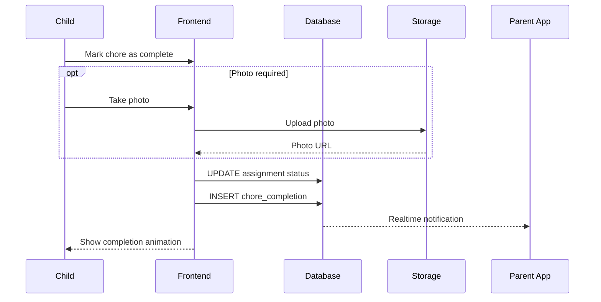
```mermaid
sequenceDiagram
    participant Child
    participant Frontend
    participant Database
    participant Storage
    participant Parent App

    Child->>Frontend: Mark chore as complete
    opt Photo required
        Child->>Frontend: Take photo
        Frontend->>Storage: Upload photo
        Storage-->>Frontend: Photo URL
    end
    Frontend->>Database: UPDATE assignment status
    Frontend->>Database: INSERT chore_completion
    Database-->>Parent App: Realtime notification
    Frontend-->>Child: Show completion animation
```

---

### Verify Chore Completion Flow

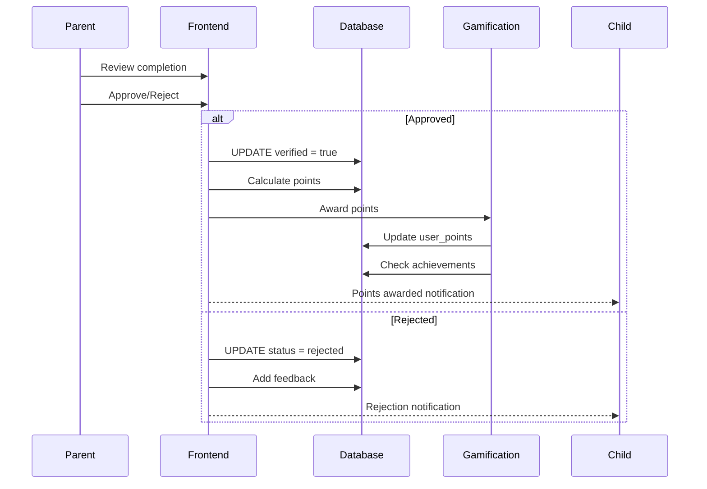
```mermaid
sequenceDiagram
    participant Parent
    participant Frontend
    participant Database
    participant Gamification

    Parent->>Frontend: Review completion
    Parent->>Frontend: Approve/Reject
    alt Approved
        Frontend->>Database: UPDATE verified = true
        Frontend->>Database: Calculate points
        Frontend->>Gamification: Award points
        Gamification->>Database: Update user_points
        Gamification->>Database: Check achievements
        Frontend-->>Child: Points awarded notification
    else Rejected
        Frontend->>Database: UPDATE status = rejected
        Frontend->>Database: Add feedback
        Frontend-->>Child: Rejection notification
    end
```

---

## Educational Content Workflows

### Content Discovery Flow

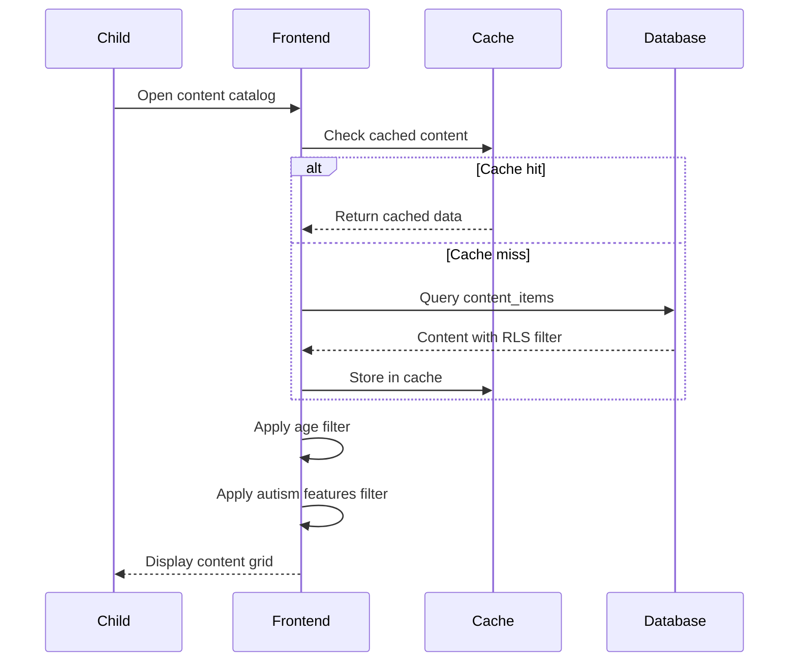
```mermaid
sequenceDiagram
    participant Child
    participant Frontend
    participant Cache
    participant Database

    Child->>Frontend: Open content catalog
    Frontend->>Cache: Check cached content
    alt Cache hit
        Cache-->>Frontend: Return cached data
    else Cache miss
        Frontend->>Database: Query content_items
        Database-->>Frontend: Content with RLS filter
        Frontend->>Cache: Store in cache
    end
    Frontend->>Frontend: Apply age filter
    Frontend->>Frontend: Apply autism features filter
    Frontend-->>Child: Display content grid
```

---

### Game Session Flow

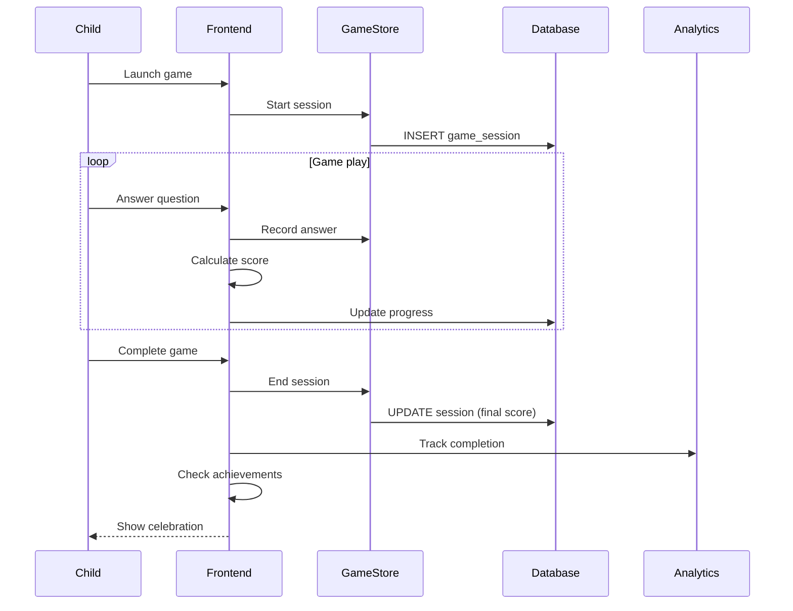
```mermaid
sequenceDiagram
    participant Child
    participant Frontend
    participant GameStore
    participant Database
    participant Analytics

    Child->>Frontend: Launch game
    Frontend->>GameStore: Start session
    GameStore->>Database: INSERT game_session
    loop Game play
        Child->>Frontend: Answer question
        Frontend->>GameStore: Record answer
        Frontend->>Frontend: Calculate score
        Frontend->>Database: Update progress
    end
    Child->>Frontend: Complete game
    Frontend->>GameStore: End session
    GameStore->>Database: UPDATE session (final score)
    Frontend->>Analytics: Track completion
    Frontend->>Frontend: Check achievements
    Frontend-->>Child: Show celebration
```

---

### Progress Tracking Flow

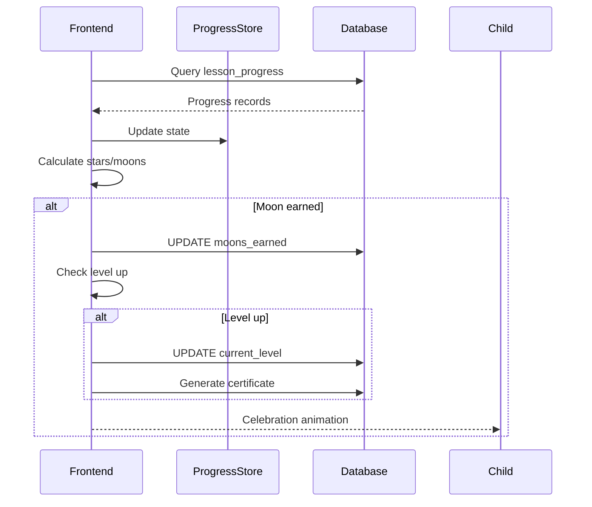
```mermaid
sequenceDiagram
    participant Frontend
    participant ProgressStore
    participant Database

    Frontend->>Database: Query lesson_progress
    Database-->>Frontend: Progress records
    Frontend->>ProgressStore: Update state
    Frontend->>Frontend: Calculate stars/moons
    
    alt Moon earned
        Frontend->>Database: UPDATE moons_earned
        Frontend->>Frontend: Check level up
        alt Level up
            Frontend->>Database: UPDATE current_level
            Frontend->>Database: Generate certificate
        end
        Frontend-->>Child: Celebration animation
    end
```

---

## Gamification Workflows

### Points Award Flow

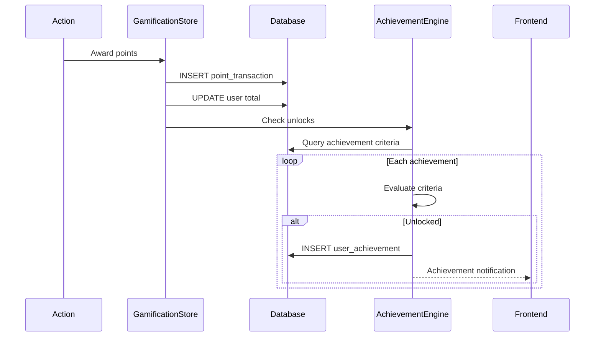
```mermaid
sequenceDiagram
    participant Action
    participant GamificationStore
    participant Database
    participant AchievementEngine

    Action->>GamificationStore: Award points
    GamificationStore->>Database: INSERT point_transaction
    GamificationStore->>Database: UPDATE user total
    GamificationStore->>AchievementEngine: Check unlocks
    AchievementEngine->>Database: Query achievement criteria
    
    loop Each achievement
        AchievementEngine->>AchievementEngine: Evaluate criteria
        alt Unlocked
            AchievementEngine->>Database: INSERT user_achievement
            AchievementEngine-->>Frontend: Achievement notification
        end
    end
```

---

### Leaderboard Update Flow

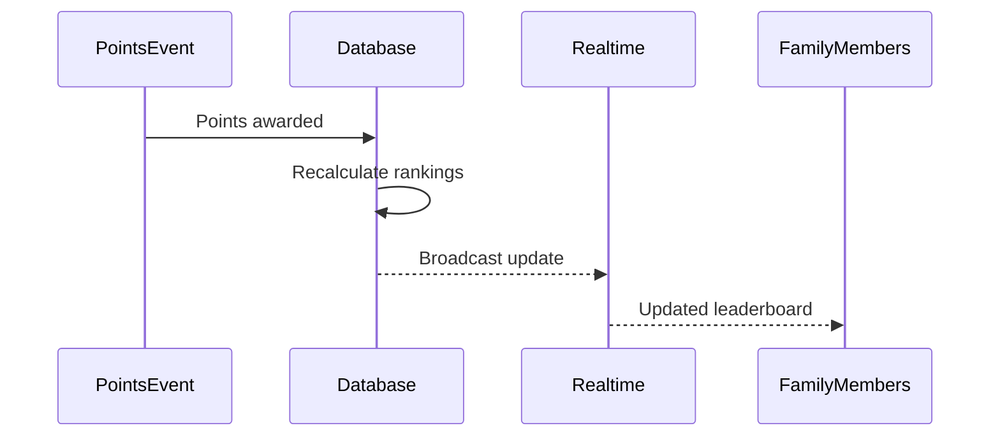
```mermaid
sequenceDiagram
    participant PointsEvent
    participant Database
    participant Realtime
    participant FamilyMembers

    PointsEvent->>Database: Points awarded
    Database->>Database: Recalculate rankings
    Database-->>Realtime: Broadcast update
    Realtime-->>FamilyMembers: Updated leaderboard
```

---

## Admin Workflows

### User Management Flow

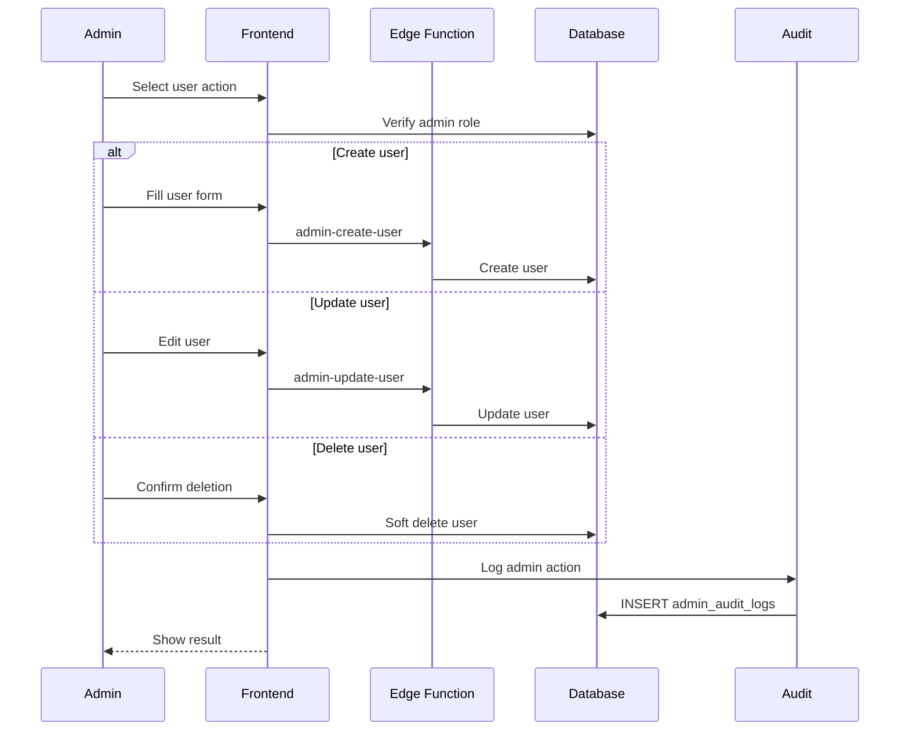
```mermaid
sequenceDiagram
    participant Admin
    participant Frontend
    participant Edge Function
    participant Database
    participant Audit

    Admin->>Frontend: Select user action
    Frontend->>Database: Verify admin role
    
    alt Create user
        Admin->>Frontend: Fill user form
        Frontend->>Edge Function: admin-create-user
        Edge Function->>Database: Create user
    else Update user
        Admin->>Frontend: Edit user
        Frontend->>Edge Function: admin-update-user
        Edge Function->>Database: Update user
    else Delete user
        Admin->>Frontend: Confirm deletion
        Frontend->>Database: Soft delete user
    end
    
    Frontend->>Audit: Log admin action
    Audit->>Database: INSERT admin_audit_logs
    Frontend-->>Admin: Show result
```

---

### Content Moderation Flow

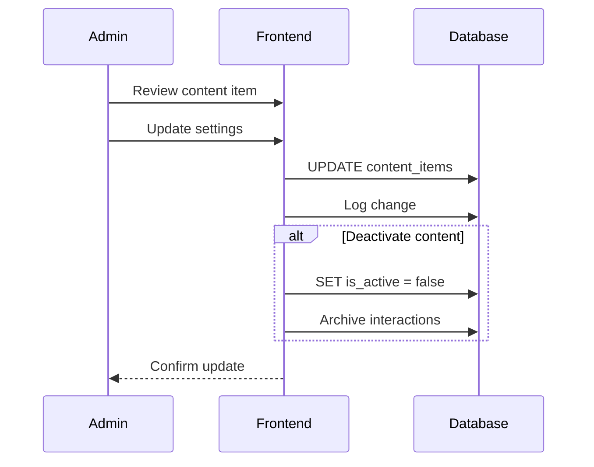
```mermaid
sequenceDiagram
    participant Admin
    participant Frontend
    participant Database

    Admin->>Frontend: Review content item
    Admin->>Frontend: Update settings
    Frontend->>Database: UPDATE content_items
    Frontend->>Database: Log change
    
    alt Deactivate content
        Frontend->>Database: SET is_active = false
        Frontend->>Database: Archive interactions
    end
    
    Frontend-->>Admin: Confirm update
```

---

## Error Recovery Workflows

### Session Recovery Flow

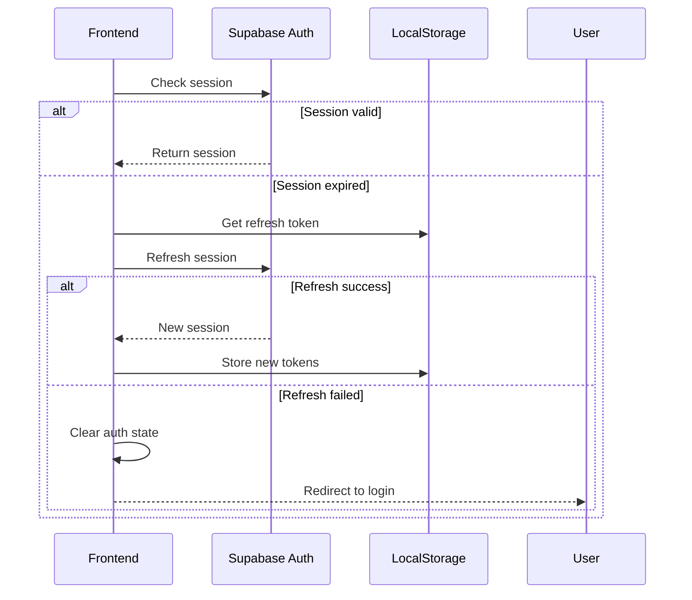
```mermaid
sequenceDiagram
    participant Frontend
    participant Supabase Auth
    participant LocalStorage

    Frontend->>Supabase Auth: Check session
    alt Session valid
        Supabase Auth-->>Frontend: Return session
    else Session expired
        Frontend->>LocalStorage: Get refresh token
        Frontend->>Supabase Auth: Refresh session
        alt Refresh success
            Supabase Auth-->>Frontend: New session
            Frontend->>LocalStorage: Store new tokens
        else Refresh failed
            Frontend->>Frontend: Clear auth state
            Frontend-->>User: Redirect to login
        end
    end
```

---

### Data Sync Recovery Flow

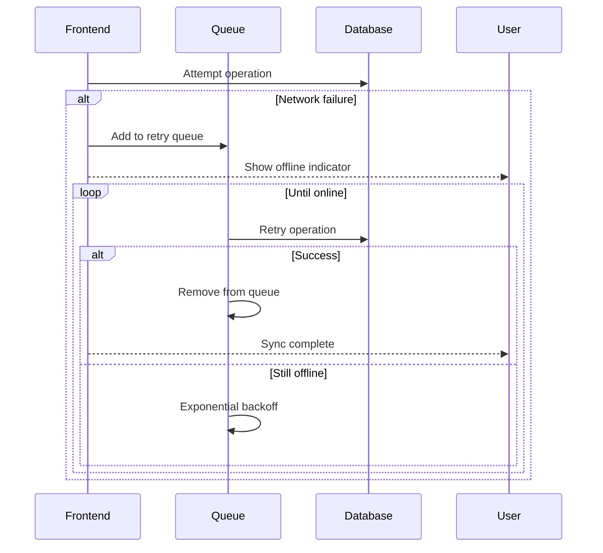
```mermaid
sequenceDiagram
    participant Frontend
    participant Queue
    participant Database

    Frontend->>Database: Attempt operation
    alt Network failure
        Frontend->>Queue: Add to retry queue
        Frontend-->>User: Show offline indicator
        
        loop Until online
            Queue->>Database: Retry operation
            alt Success
                Queue->>Queue: Remove from queue
                Frontend-->>User: Sync complete
            else Still offline
                Queue->>Queue: Exponential backoff
            end
        end
    end
```

---

### Error Boundary Recovery

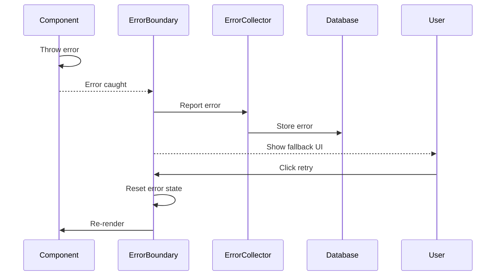
```mermaid
sequenceDiagram
    participant Component
    participant ErrorBoundary
    participant ErrorCollector
    participant Database
    participant User

    Component->>Component: Throw error
    Component-->>ErrorBoundary: Error caught
    ErrorBoundary->>ErrorCollector: Report error
    ErrorCollector->>Database: Store error
    ErrorBoundary-->>User: Show fallback UI
    
    User->>ErrorBoundary: Click retry
    ErrorBoundary->>ErrorBoundary: Reset error state
    ErrorBoundary->>Component: Re-render
```

---

## Workflow Monitoring

### Key Metrics

| Workflow | Success Rate Target | Avg Duration Target |
|----------|---------------------|---------------------|
| Login | 99.5% | < 2s |
| Registration | 98% | < 5s |
| Child Account Creation | 99% | < 3s |
| Chore Assignment | 99.9% | < 1s |
| Game Session | 99% | Variable |
| Points Award | 99.9% | < 500ms |

### Error Tracking

All workflows log to:
- `system_errors` - Error details
- `user_activity_logs` - User actions
- `admin_audit_logs` - Admin operations
- `security_events` - Security-related events

---

## Version History

| Version | Date | Changes |
|---------|------|---------|
| 1.0.0 | 2026-01-21 | Initial documentation |
